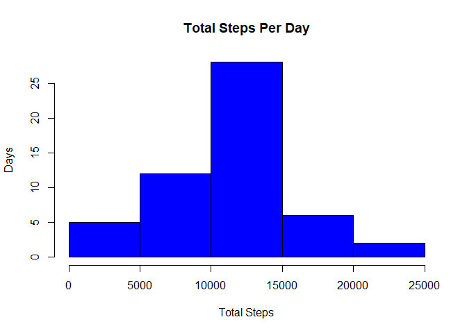
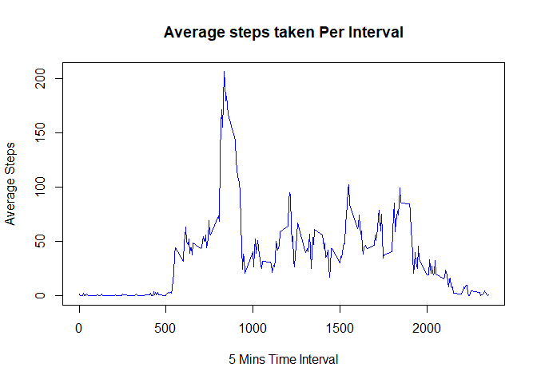
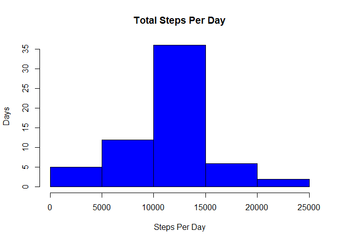
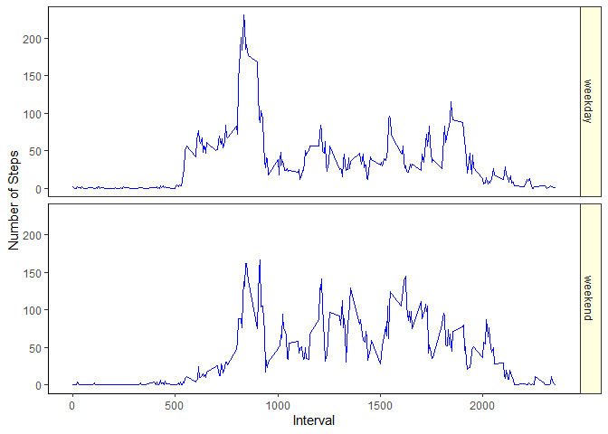

## Setting echo true to read the code


## Loading and processing the data


```r
activityData <- unzip("activity.zip")
activityData <- read.csv(activityData)
processedData <- na.omit(activityData)
processedData$date <- as.Date(processedData$date)
```

## What is mean total number of steps taken per day?


```r
library(dplyr, exclude = c("lag", "intersect", "setdiff", "setequal", "union", "filter")) # Excluded unused objects to avoid conflicts
histData <- processedData %>% group_by(date) %>% summarise(totalSteps=sum(steps), .groups = NULL) 
hist(histData$totalSteps,  xlab = 'Total Steps' , ylab = 'Days', col = 'blue', main="Total Steps Per Day", border= 'black')
```

<!-- -->

Calculate and report Mean / median of total steps per day 


```r
totalStepsMean <-  mean(histData$totalSteps)
totalStepsMedian <-  median(histData$totalSteps)
totalStepsMean # prints Mean of Total Steps
```

```
## [1] 10766.19
```

```r
totalStepsMedian # prints Median of Total Steps
```

```
## [1] 10765
```

## What is the average daily activity pattern?


```r
intervalDataset <- processedData %>% group_by(interval) %>%  summarise(AvgSteps=mean(steps), .groups = NULL) 
plot(intervalDataset$interval ,intervalDataset$AvgSteps, type='l',  xlab = '5 Mins Time Interval' , ylab = 'Average Steps', col = 'blue', main="Average steps taken Per Interval")
```

<!-- -->

```r
maxStepInterval <- intervalDataset$interval[which.max(intervalDataset$AvgSteps)]

maxStepInterval # prints Max Average Steps Interval
```

```
## [1] 835
```

## Imputing missing values

Calculate and report the total number of missing values in the dataset (i.e. the total number of rows with NAs)


```r
missingNAs <- sum(is.na(activityData$steps))
missingNAs  # prints NAs filled rows count
```

```
## [1] 2304
```

Devise a strategy for filling in all of the missing values in the dataset. The strategy does not need to be sophisticated. For example, you could use the mean/median for that day, or the mean for that 5-minute interval, etc. Create a new dataset that is equal to the original dataset but with the missing data filled in.


```r
NADatasets <- activityData
for (i in 1:nrow(NADatasets)){
 if (is.na(NADatasets$steps[i])) {
        index <- which(NADatasets$interval[i] == intervalDataset$interval)
        NADatasets$steps[i] <- intervalDataset[index,]$AvgSteps
    }
}
NADatasets$date <- as.Date(NADatasets$date)
```

Make a histogram of the total number of steps taken each day and Calculate and report the mean and median total number of steps taken per day. Do these values differ from the estimates from the first part of the assignment? What is the impact of imputing missing data on the estimates of the total daily number of steps?


```r
NAfilledHistData <- NADatasets %>% group_by(date) %>% 
  summarise(totalSteps=sum(steps), .groups = NULL) 
NAfilledTotalStepsMean = mean(NAfilledHistData$totalSteps)
NAfilledTotalStepsMedian = median(NAfilledHistData$totalSteps)
hist(NAfilledHistData$totalSteps,  xlab = 'Steps Per Day' , ylab = 'Days', col = 'blue', main="Total Steps Per Day", border= 'black')
```

<!-- -->

## Are there differences in activity patterns between weekdays and weekends?


Create a new factor variable in the dataset with two levels -- "weekday" and "weekend" indicating whether a given date is a weekday or weekend day.


```r
NADatasets$day <- weekdays(NADatasets$date)
NADatasets$daytype <- "weekday"
NADatasets$daytype[NADatasets$day %in% c("Saturday", "Sunday")] <- "weekend"
```

Make a panel plot containing a time series plot (i.e. type = "l") of the 5-minute interval (x-axis) and the average number of steps taken, averaged across all weekday days or weekend days (y-axis). The plot should look something like the following, which was created using simulated data:


```r
options(dplyr.summarise.inform = FALSE)
averageDay <- NADatasets %>% group_by(daytype, interval) %>% summarise(AvgSteps = mean(steps))
library(ggplot2)
ggplot(data = averageDay, aes(interval, AvgSteps)) +  theme_bw() +
  theme(axis.line = element_line(colour = "black"),
    panel.grid.major = element_blank(),
    panel.grid.minor = element_blank(),
    panel.background = element_blank()) + 
  geom_line(color = "blue", linewidth = 0.5) + 
  labs(main = "Average Steps taken on Weekends vs Weekdays",
       y = "Number of Steps", x = "Interval") +
 facet_grid( daytype ~.) + theme(strip.background=element_rect(fill="lightyellow"))
```

<!-- -->

From inferences, the plot displays more steps activity pattern on weekdays than on weekends
